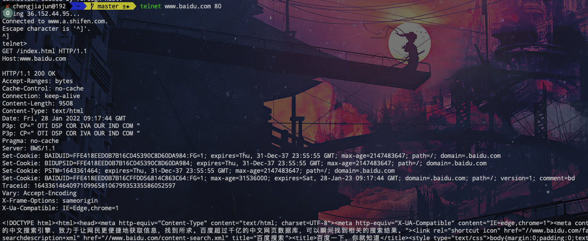

# 一 应用层协议原理

## 1. 网络应用体系结构

网络应用体系结构主要分为两种,客户-服务器体系结构和 p2p体系结构

### 1.1 体系结构

==客户体系结构==

这种体系结构的特点是一直有一个总是打开的主机, 它服务于来自许多其他称为客户的主机的请求. 客户的主机之间不进行直接的通信,但是在我们的服务器是有一个固定的IP的

==p2p体系结构==

在p2p系统结构中,对于数据中心的专用服务器有最小的依赖, 相反, 是在主机之间进行直接的联系, 这些主机被称为是对等方

### 1.2 进程通信

在两个不同的端系统中,通过跨过计算机网络交换报文而相互通信

#### 1.2.1 客户和服务器进程

网络应用的进程是由成对的进程组成的,这些进程通过网络互相发送报文,在一个p2p文件共享系统中,对于每一对进程,我们将其分为是client和server,对于web而言, 浏览器是一个客户进程,web是一个服务器进程.,在p2p体系中,一个进程既能是服务器进程也能是客户进程,我们将发起通信的称为是我们的客户,将接受通信的称为是我们的服务器

#### 1.2.2 进程与计算机网络之间的接口

多数应用程序是由通信的进程对组成的, 每个进程必须通过socket 这个接口去向网络接收和发送请求.

#### 1.2.3 进程寻址

为了向特定目的地发送邮政地址, 目的地需要有一个地址, 类似的, 在一台主机上运行的进程为了向另外一台主机上发送信息的时候,需要一个地址,

为了标示该接受进程,我们需要定义两种信息 1. 主机的地址 2. 在目的主机中指定接受进程的标示符

地址其实就是IP, 一个32位的比特, 目的地端口号是用来给我们不同的应用去分配的,防止我们的进程之间发生冲突


### 1.3 可供应该程序使用的运输服务

#### 1.3.1 可靠数据传输

在我们传输的数据过大的时候可能会出现我们的可靠数据传输错误,即我们所说的丢包

#### 1.3.2 吞吐量

吞吐量指的是在我们的数据传输的过程中,我们的应用能够承受的最大速率

#### 1.3.3 定时

保证我们的数据从发出方到接受方的延时不会超过特定的时间

#### 1.3.4 安全性

运输协议能够为应用程序提供安全服务. 


## 1.4 因特网提供的运输服务

互联网提供的传输服务主要是有TCP/IP,为运输层提供的主要是UDP/TCP

#### 1.4.1 TCP服务

当某个应用程序调用TCP作为其运输协议时, 该应用程序就可以获得来自TCP的这两种服务

1. 面向连接的服务
2. 可靠的数据传输服务

TCP协议还具有拥赛控制的机制,在发送方和接受方之间出现拥塞的时候, TCP会抑制发送端的发送

#### 1.4.2 UDP服务

是一种提供不必要服务的一种轻量化运输协议, 它仅提供最小服务, 在两个进程之间是没有握手的过程的,在传输报文的时候, 不仅不保证传输到大, 还不保证顺序(流氓了属于是)


### 1.5 应用层协议

应用层协议主要是包含了如何去构造我们的报文, 主要包括下面的几种

1. 交换的报文的类型
2. 各种报文类型的语法
3. 字段的语意
4. 确定一个进程是何时以及是如何发送报文的, 对报文进行响应的规则


# 二 Web and HTTP

### 2.1 HTTP概况

Web的应用层协议是超文本传输协议, HTTP由两个程序实现: 一个客户程序和一个服务器程序

在Web界面存储的文件可以通过我们的URL地址进行寻址, 每个URL都由两个部分组成,一个是我们的主机的地址,一个是我们的文件存放的路径

当我们请求一个Web页面,浏览器向我们的服务器发出该页面所包含对象的HTTP报文, 服务器接收到请求并用包含这些对象的HTTP响应报文进行响应,HTTP是使用我们的TCP作为我们的支撑运输协议(而不是在UDP上运行),发送请求的时候我们的报文其实是由我们的http的socket进行发送的,被tcp所控制,所以一定能到达我们的目的地

HTTP的特性: 服务器不存储客户的状态,所以服务器会响应我们在很短时间内发送的两次请求,故HTTP协议是一个无状态协议,

### 2.2 非持续连接和持续连接

​	在用户和服务器进行长时间通信的时候,可以选择使用以规则的间隔周期性地或者间断性地一个个发出.在设计上的区别是是否使用同一个TCP,还是对每一个请求都使用不同的TCP(HTTP在默认条件下是使用连续性连接的)

采用非持续连接的HTTP:

1. HTTP客户进程在端口号80发起一个到服务器上的TCP连接,该端口是我们的HTTP的默认端口
2. 客户通过socket向该服务器发送一个HTTP请求报文, 该报文中包含了网站的index
3. HTTP服务器从他的sockets中接收到我们的报文
4. HTTP服务器通知TCP断开该TCP连接
5. HTTP客户接受响应报文
6. 对每个引用的对象重复上面的操作

在上述的操作中,我们使得我们的浏览器每次打开5-10个并行的TCP连接,每个连接处理一个请求业务,当我们将最大并行连接数设置为1的时候,我们将串行处理我们的

 采用持续连接的HTTP:

在使用非持续连接的时候,必须每一个都为请求的对象建立和维护一个全新的连接,对于每个这样的连接都需要去建立和维护一个全新的连接

可以使用相同的TCP去处理我们发送的请求


### 2.3 HTTP报文格式

#### 1. HTTP请求报文

```python
GET /somedir/page.htm HTTP/1.1
# 这一行被称为是请求行, 其后继的行叫做首部行,请求行有三个字段: 方法字段, URL字段, HTTP版本字段
# 方法字段可以使用GET POST HEAD PUT DELETE 几种方式,主要是使用我们的GET
Host: www.someschool.com
Connection: close
User-agent: Mozilla/5.0
Accpect-language: fr
```

#### 2.HTTP响应报文

```python
HTTP/1.1 200 ok
# 表示我们的服务器正在使用HTTP/1.1 200ok表示的是我们的状态
Connection: close
# 首部行告诉我们的客户在发送完报文之后我们的连接将会被关闭
Date: Tu, 18 Aug 2015 15:44:04 GMT
Server: Apache/2.2.3 Centos
Last_Modified: Tue, 18, Aug 2015 15:11:03 GMT
# 创建者上次修改的时间
Content-Type: text/html
(data....data)
```

### 2.4 用户和服务器的交互: cookie

cookie服务有四个组件

1. 在HTTP响应的报文中的一个cookie首部行
2. 在HTTP请求报文中的一个cookie 首部行
3. 在用户端系统中保存有一个cookie文件,并由用户的浏览器进行管理
4. 位于web站点的一个后端数据库

cookie的作用在于识别我们的用户,在访问我们的站点一次后会记住我们的账户密码

### 2.5 Web缓存

Web缓存器也被称为是代理服务器,一旦浏览器被配置,每个对某对象的浏览器请求首先被定向到该Web缓存器

在请求一个数据的时候,会发生下面的内容

1. 浏览器创建一个到Web服务器的TCP链接,并向我们的对象发送一个HTTP请求
2. Web缓存器进行检查, 看看本地是否存储了该对象副本, 如果有, Web缓存器发送一个HTTP响应报文
3. 如果Web缓存器中没有该对象,它就建立一个与该对象的初始服务器之间的TCP链接,web缓存器则在这个缓存器到服务器的TCP
4. 当接受到该对象之后, 在本地的空间内保存一份副本,同时向我们的客户发送该副本

在使用我们的Web缓存器的时候可以加速我们的请求

### 2.6 条件GET方法

在我们的Web缓存器中可能存储较旧的对象, 所以在请求中的报文中可以加上If-modified-since 参数
> 我们可以使用telnet这个终端工具去获取我们的报文

在使用`telnet www.example.com` 后,在>界面再按一次回车,将我们在其他地方写好的报文复制
到这个地方,再按一次回车键即可


## 三. 因特网中的电子邮件
因特网电子邮件主要由是三个部分组成-用户代理,邮件服务器,简单邮件传输协议(SMTP)
邮件服务器是我们的电子邮件体系结构的核心,每个接受方都在我们的服务器上有一个邮箱 ,这个邮箱维护着发送给用户的报文
邮件的发送过程是:
1. 从用户方的代理开始发送到发送方的邮件服务器
2. 连接到接收者的邮箱, 将邮件传送到对方的邮件服务器
3. 由接收者的邮箱服务器发送到接收者的邮箱

在邮件的发送中发送方的服务器A维持着一个报文队列,当我们的服务器不能将邮件传送到我们的接收者的服务器的时候,将在报文队列中进行存储,在30min后尝试重新发送,如果几天之内都不能发送成功,那么将删除该报文并通知发送者
### 3.1 SMTP
SMTP是一种出现了很长时间的传输协议,但是它也有受到限制部分,比如限制我们的报文的主体部分只能是七个字节,同时需要将我们的二进制文件转化为ASCII码.
The path
```
A -> agent of A -> the server of A -SMTP->the server of Bob -> the agent of Bob
```

不要尝试去使用qq邮箱发送报文,会变得不幸

### 3.2 POP3

是一个极其简单的协议,在特许阶段使用


## 四.DNS: 因特网的目录服务

### 4.1 DNS提供的服务

​	人们更倾向于使用主机名去记忆主机,但是对于路由器而言,更加倾向于使用有层次的IP地址

DNS是:

 	1. 一个由分层的DNS服务器实现的分布式数据库
 	2. 一个使得主机能够查询分布式数据库的应用协议

简单而言,DNS是一个将我们的主机名称转换为IP地址的工具

DNS的工作原理:

1. 同一台用户主机上运行着DNS应用的客户端
2. 浏览器从URL中抽取出主机的名称,然后将其传送到我们的DNS的服务端
3. DNS客户向DNS服务器发送一个包含主机名的请求
4. DNS客户将收到来自DNS服务器的一个回答报文,其中包含对应该主机名的IP地址
5. 一旦浏览器接收到该IP地址,它能够像位于该IP地址的80端口的HTTP服务器发起一个TCP请求


### 4.3 DNS工作机理概述

在运行DNS服务的时候可能会出现很多的问题,比如

1. 单点故障:如果该DNS服务器发生故障,将导致整个因特网的故障
2. 通信容量:单个DNS服务器不得不去处理所有的DNS查询
3. 远距离的集中分布式数据库: 单个的DNS服务器不可能查询临近的所有查询客户, 如果我们将单台DNS服务器放在纽约市, 那么所有来自澳大利亚的查询必须到地球的另外一端,中间可能在我们的链路上造成严重的时延
4. 维护: 单个的DNS服务器上需要为所有的因特网服务进行数据的存储

#### 4.3.1 分布式.层次性的数据库

我们的DNS服务器大致分为三种类型: 1. 根DNS服务器 2. 顶域级服务器 3. 权威DNS服务器

根DNS服务器: 400多个根服务器的名字遍及全世界, 由不同的组织进行管理

顶级域服务器: 对于每一个顶级的域名,如 .edu, .cn. .com 都由不同的公司进行管理

权威DNS服务器: 在因特网上具有权威的公共可访问主机,如Web服务器和邮件服务器,每个公司都提供自己的DNS可访问记录

访问的顺序通常为从本机像我们的本机DNS服务器进行访问,然后由本机服务器和根服务器, TLD DNS服务器, 权威DNS服务器进行交互式的访问

###  4.2 DNS缓存

和之前我们提到的在链路上的缓存一样,使用DNS缓存可以实现我们的快速访问

### 4.3 DNS记录和报文

资源记录是一个包含了下列字段的四元组

`(Name, Value, Type, TTL)`

- 如果Type=A,那么Name中记录的是我们的主机名, Value是该主机名对应的IP地址,因此,一个类型为A的资源记录提供了标准的主机名到IP地址的映射
- 如果Type=NS,则Name是个域,如(xx.com),而Value是个知道如何获得该域名中主机IP地址的权威IP地址的权威DNS服务器的主机名,这个记录用于沿着查询链来陆游DNS查询,例如(foo.com, dns.fool.com,NS)是一个类型为NS的记录
- 如果Type=CANME, 则Value是别名为Name的主机对应的规范主机名,用于向查询的主机提供一个主机名对应的规范主机名, 例如`(foo.com, relay1.bar.foo.com, CNAME) `就是一条CNAME类型的记录
- 如果Type=Mx, 则Value是个别名为Name的邮件服务器的规范主机名,举例来说`(foo.com, mail,bar, foo,com, Mx)` 就是一个MX记录, MX记录允许服务器有一个简单的别名, 为了获得一个规范的主机名,DNS客户可以进行CNAME查询

如果一个主机是用于特定的主机的权威DNS服务器, 那么该服务器中会存储着一条类型为A的记录, 如果该服务器不是我们所说的权威DNS服务器, 它仍然会在我们的服务器中储存着我们的类型为A的记录

#### 4.3.1 DNS报文

DNS报文中各字段的语义如下


- 前12个字节是首部区域, 其中有几个字段, 第一个字段是一个16比特的数,用于标识该查询, 如首部的一个比特表示是0/1(查询报文/回答报文)
- 问题区域包含着正在进行的查询信息, 该区域包括1. 名字字段,包含正在被查询的主机名字  2.类型字段,指出有关该名字的正被查询的问题类型, 例如主机地址是与一个名字相关联
- 在来自DNS服务器的回答中,回答区域包括了对最初请求的名字的资源记录
- 权威区域包含了其他权威服务器的记录
- 附加区域包含了其他有帮助的记录, 例如对一个MX请求的回答报文的回答区域包含了一条资源记录

#### 4.3.2 向DNS数据库中插入记录

和我们没啥关系


## 五 P2p文件分发

使用p2p或者是BitTorrent的优点在于可以提高我们的分发的速率

p2p的模式下我们的单个用户在链路上的能力也能被利用

在分发的开始,只有服务器具有文件, 为了使得社区内的每个对等方能过帮助服务器接收文件, 最小的分发时间是$F/U_s$

同时具有最低下载速度的对等方的下载时间为 $F/d_{min}$

最后, 观察到系统整体的总上载能力等于服务器的总上载能力加上单个的对等方的上载能力,所以总的时间为$NF/(U_s+\sum_{i=1}^NU_i)$

### 5.1 BitTorrent

是一种用于文件分发的流行的p2p协议


## 六 视频流和内容分发网

### 6.1 因特网视频

在流式存储视频应用中,基础的媒体是预先录制的视频,例如电影,电视节目,预先录制的体育事件或者录制好的用户生成的视频

### 6.2 HTTP流和Dash

​	在HTTP流中,我们的视频只是储存在HTTP服务器中作为一个普通的文件, 每个文件有一个特定的URL, 当用户要去看这个视频的时候, 客户和服务器创建一个TCP连接并发送对该URL的HTTP的GET请求. 服务器则以底层网络协议和流量条件允许的尽可能快的速率, 在一个HTTP响应报文中发送该视频文件. 

​	由于客户可用的流量是不同的,所以此时我们需要去使用CDN去进行我们的分发,在DASH中,我们的视频被编码为几个不同的版本, 每个版本有不同的比特率, 对应不同的质量水平

### 6.3 内容分发网

​	对于一个视频网站公司, 我们能做的有直接建立一个数据中心向全世界发送视频, 但是当我们的客户原理用户中心的时候, 服务器到客户的分组的通信链路可能会消耗很多的ISP, 其中很多的ISP可能位于不同的大洲,在中途可能存在很多的损失,所以很多公司选择使用我们的CDN

​	CDN有两种操作的原则:

	1. 深入: 第一个原则由Akamai首创, 该原则是通过遍及全球的接入ISP中部署服务器集群来深入到ISP的接入网中
	1. 邀请做客: 由Limelight和许多其他的CDN公司所采用,通过在关键位置建造大集群来邀请ISP做客, 不是将集群放在接入ISP中, 这些CDN通常将它们的集群放置在因特网交换点(IXP),与深入设计原则相比, 邀请做客设计通常产生较低的维护和管理开销


## 七 套字节编程

### 7.1 UDP套字节编程

​	通过套字节编程我们可以在我们的不同主机之间建立连接

​	下面给出的是在我们的客户端的代码

```python
#!/usr/bin/env python3
# -*- coding: utf-8 -*-

from socket import *

servername = "127.0.0.1"
serverport = 9999
clientsocket = socket(AF_INET, SOCK_DGRAM)
# AF_INET表示使用的是IPV4,SOCK_DGRAM表示它是一个UDP
while True:
    message = input("What do you wants to say\n")
    clientsocket.sendto(message.encode(), (servername, serverport))
    modify, address = clientsocket.recvfrom(2048)
    # modify得到的是客户端的回应,address中得到的是我们的服务器的地址
    print(modify.decode())
		# decode将字节转换为字符串
```

​	下面给出服务器端的代码

```python
#!/usr/bin/env python3
# -*- coding: utf-8 -*-

from socket import *

serverport = 9999
# 注意的是端口号要保持统一
clientsocket = socket(AF_INET, SOCK_DGRAM)
clientsocket.bind(('',serverport))
print("The server is ready to send")
while True:
    data, address = clientsocket.recvfrom(2048)
    data1 = data.decode().upper()
    # 将接收到的全部变为大写
    clientsocket.sendto(data1.encode(),address)
```

### 7.2 TCP套字节编程

下面给出的是我们的客户端的代码

```python
from socket import *

servername = "127.0.0.1"
serverport = 9999
client = socket(AF_INET, SOCK_STREAM)
client.connect((servername, serverport))
message = input("Please input the sentence")
client.send(message.encode())
reply = client.recv(1024).decode()
print("From server: ", reply)
client.close()
```

下面给出的是我们服务器端的代码

```python
from socket import *

sewrverport = 9999
server = socket(AF_INET, SOCK_STREAM)
server.bind(('', sewrverport))
server.listen(50) # 表示最多有50个server同时连接
print("Ready to receive")
while True:
    connect, address = server.accept()
    sentence = connect.recv(1024).decode()
    get = sentence.upper()
    connect.send(get.encode())
    connect.close()
```

